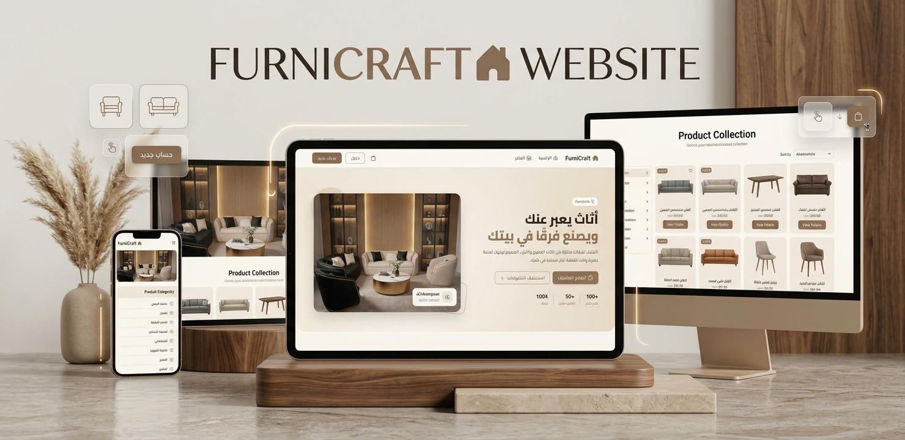
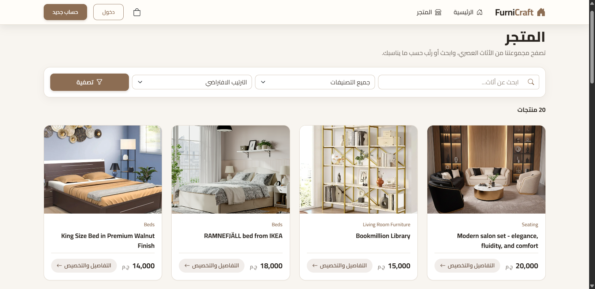
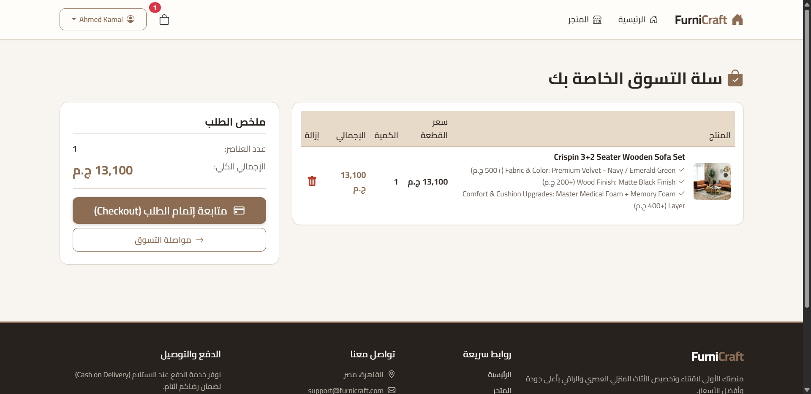
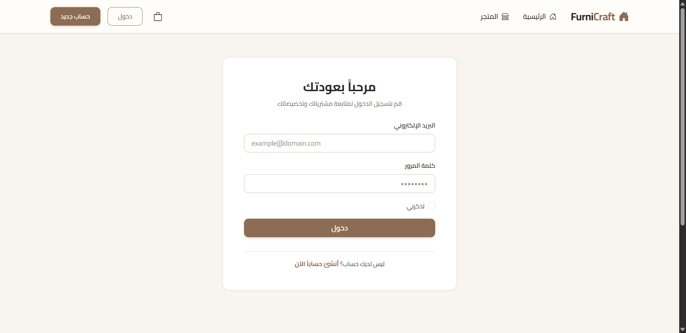

# 🪑 FurniCraft

A furniture e-commerce web application with an Arabic (RTL) interface, built with **ASP.NET Core MVC**.
Customers can browse furniture by category, view product details, add items to a cart, and place orders with cash on delivery.

🌐 **Live Demo:** [furnicraft-ahmed-kamal.runasp.net](http://furnicraft-ahmed-kamal.runasp.net/)

---

## 📸 Screenshots

<!-- Add your screenshots to a /screenshots folder in this repo, then keep or edit the lines below -->

| Home | Shop | Product Details |
| :---: | :---: | :---: |
|  |  |  |

| Cart | Login / Register |
| :---: | :---: |
|  |  |

---

## ✨ Features

### 🛋️ Customer Features

- Home page with featured products and category shortcuts
- Product catalog (Beds, Chairs, Living Room Furniture, Seating, Tables)
- Filter products by category
- Product details pages
- Shopping cart
- User registration and login
- Cash on delivery (COD) checkout
- Arabic right-to-left (RTL) responsive interface

---

## 🧰 Technologies

- **C#**
- **ASP.NET Core MVC**
- **Entity Framework Core** (Code First migrations)
- **Razor Views**
- **HTML5 / CSS3 / JavaScript**
- **Git & GitHub**

---

## 🏗️ Project Structure

```
FurniCraft/
│
├── Controllers/     # Request handling
├── Data/            # DbContext and data access
├── Migrations/      # EF Core migrations
├── Models/          # Application entities
├── Services/        # Business logic layer
├── ViewModels/      # Data passed between controllers and views
├── Views/           # Razor UI
├── wwwroot/         # Static files (CSS, JS, product images)
│
├── Program.cs
├── appsettings.json
└── FurniCraft.csproj
```

The project follows the **MVC pattern** with an extra **Services layer** to keep controllers thin and business logic reusable.

---

## 🚀 Getting Started

### Prerequisites

- [.NET SDK](https://dotnet.microsoft.com/download)
- A supported database server (update the connection string in `appsettings.json`)
- Git

### Installation

```bash
# Clone the repository
git clone https://github.com/ahmedkamal-31/FurniCraft.git
cd FurniCraft

# Restore dependencies
dotnet restore

# Update the connection string in appsettings.json, then apply migrations
dotnet ef database update

# Run the application
dotnet run
```

Or open `FurniCraft.sln` in Visual Studio and run the project.

---

## 🎯 Project Goals

This project was built to practice a realistic e-commerce workflow with ASP.NET Core MVC, including:

- MVC architecture with a services layer
- Entity Framework Core and Code First migrations
- ViewModels and form handling
- Authentication (registration and login)
- Shopping cart and order flow
- Building an RTL (Arabic) user interface
- Deploying an ASP.NET Core application online

---

## 👨‍💻 Author

**Ahmed Kamal Mohamed**

Junior .NET Developer focused on **C# · ASP.NET Core · MVC · Entity Framework Core · SQL Server**

- GitHub: [@ahmedkamal-31](https://github.com/ahmedkamal-31)
- LinkedIn: [ahmed-kamal](https://www.linkedin.com/in/ahmed-kamal-135b8b353/)
- Portfolio: [portfolio-kappa-lake-83.vercel.app](https://portfolio-kappa-lake-83.vercel.app/)
